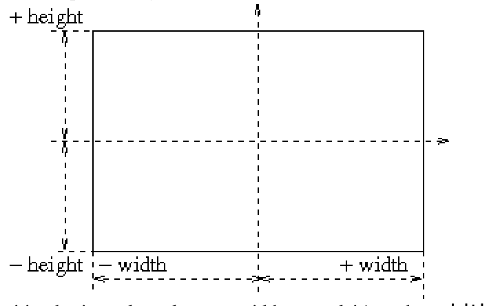

# Documentation

## Print to screen
| Return Type | Function |
| ------| -----------|
|`void`|`print(Object obj)`  Prints any object to the screen.|
|`void`|`println(Object obj)`  Prints any object to the screen then goes to new line.|

## Read Input
| Return Type | Function |
| ------| -----------|
|`String`|`readString()`  `readString(String text)`  `text` : optional text to display on the input frame.  Returns the String value of a keybord entry.|
|`Double`|`readDouble()`  `readDouble(String text)`  `text` : optional text to display on the input frame.  Returns the Double value of a keybord entry.|
|`Integer`|`readInt()` `readInteger()`  `readInt(String text)`  `readInteger(String text)`   `text` : optional text to display on the input frame.  Returns the Integer value of a keybord entry.|
|`Long`|`readLong()`  `readLong(String text)`  `text` : optional text to display on the input frame.  Returns the Long value of a keybord entry.|
|`Float`|`readFloat()`  `readFloat(String text)`  `text` : optional text to display on the input frame.  Returns the Float value of a keybord entry.|
|`Boolean`|`readBoolean()`  `readBoolean(String text)`  `text` : optional text to display on the input frame.  Returns the Boolean value of a keybord entry.|
|`Char`|`readChar()`  `readCharacter()`  `readChar(String text)`  `readCharacter(String text)`  `text` : optional text to display on the input frame.  Returns the Char value of a keybord entry.|

## Utils
| Return Type | Function |
| ------| -----------|
|`void`|`sleep(int sleepingTime)`  Stops the execution of the program during `sleepingTime` period in milliseconds.|
|`int`|`random(int min, int max)`  Returns a random value between `min` included and `max` excluded.|
|`boolean`|`equal(String s1, String s2)`  Returns `true` if the value of `s1` is exactly the same as `s2`, returns `false` if not.|

## Pixels

| Return Type | Function |
| ------| -----------|
|`void`|`reset(int w, int h)`  Creates a drawing window of width=`w` and height=`h`.|
|`int`|`getWidth()`  Returns the width value of the drawing window.|
|`int`|`getHeight()`  Returns the height value of the drawing window.|
|`boolean`|`setPixel(int x, int y, String color)`  Draws a point with a defined `color` at the coordinates (`x`, `y`).  `color`: a color string that can be one of [black, blue, cyan, grey, green, magenta, orange, red, white, yellow, pink]  Returns `true` if the point is inside of the boundaries of the drawing window, returns `false` if not.|
|`boolean`|`setPixel(int x, int y, int alpha)`  Draws a point with a defined shade of grey at the coordinates (`x`, `y`).  `alpha`: defines the shade of grey value ( min = 0 for black; max = 255 for white).  Returns `true` if the point is inside of the boundaries of the drawing window, returns `false` if not.|
|`boolean`|`setPixel(int x, int y, int r, int g, int b) `  Draws a point with a defined rgb color at the coordinates (`x`, `y`).  `r`: Red value between 0 and 255.  `g`: Green value between 0 and 255.  `b`: Blue value between 0 and 255.  Returns `true` if the point is inside of the boundaries of the drawing window, returns `false` if not.|

